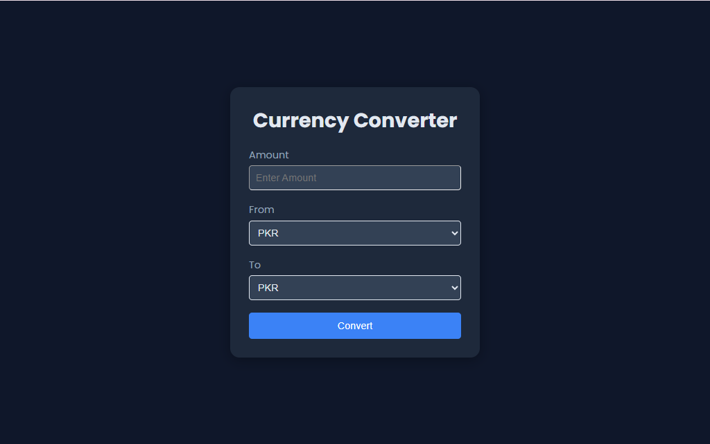
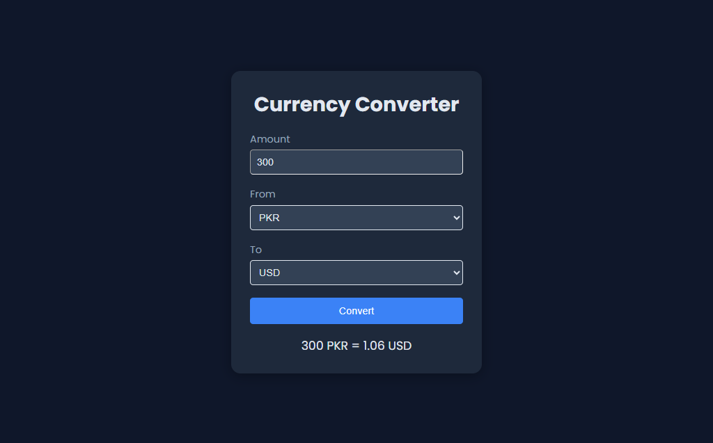

# 💱 Currency Converter

A responsive currency converter web app built with **HTML**, **CSS**, and **JavaScript**.  
It uses the **ExchangeRate API** to fetch real-time exchange rates, letting users convert between global currencies quickly and accurately through a sleek dark-themed interface.

---

## 🚀 Live Preview  
🔗 [View Live Demo](https://laibatariq110.github.io/currency-converter)

---

## 📸 Screenshots

### 🖼️ Screenshot 1 — Main Interface  

### 🖼️ Screenshot 2 — Conversion Result  

---

## ⚙️ How to Use
1. Open the folder in your code editor.
2. Run the project by opening `index.html` in your browser.
3. Enter an amount, select currencies, and click **Convert**.

---

## 🧰 Tech Stack
- **HTML5**
- **CSS3**
- **JavaScript (Fetch API)**
- **ExchangeRate API**

---

## 📂 Project Structure
currency-converter/
│
├── index.html
├── style.css
├── script.js
└── screenshots/
├── screenshot1.png
└── screenshot2.png

---
